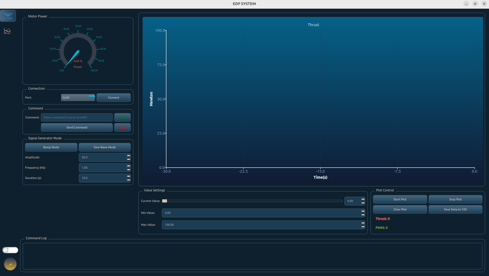

# Motor Testbench

The Motor Testbench source are specialized testing platforms designed to measure and analyze the performance of electric propulsion systems used in UAVs.


## Installation

Download the UI from [Link](https://drive.google.com/drive/folders/1KWAv9vNzF9oPzDMr9umnQywMdU2t-oCO?usp=sharing) to install UI Dashboard.

```bash
  git clone https://github.com/er1608/EDF-SYSTEM-GUI.git
  cd EDF-SYSTEM-GUI
```
    
## Features
- PWM-based motor control module 

- Force measurement module

- Sensor acquisition subsystem (vibration, RPM, voltage/current) 

- Telemetry communication via MAVLink 

- Real-time processing using NuttX RTOS 

- Local and remote data logging 


## Contributing

Pull requests are welcome. For major changes, please open an issue first to discuss what you would like to change.

Please make sure to update tests as appropriate.
## Used By

This project is used by the following company:

- CT UAV


## Authors

- [@khoatran1608](https://github.com/er1608)

